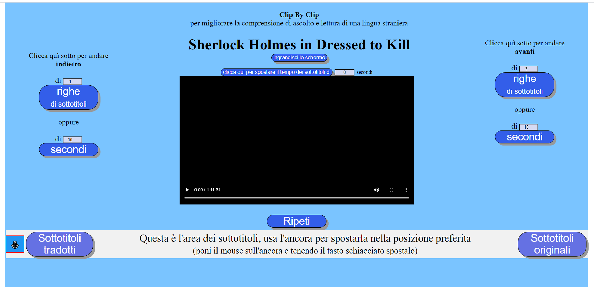
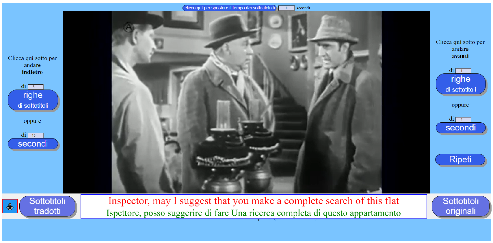

 
Clip By Clip
============

Questa applicazione si propone come strumento per migliorare la comprensione di una lingua straniera.

Permette di visionare un video o ascoltare un audio a pezzettini delle dimensioni desiderate. Ogni pezzettino può essere visto o ascoltato più volte di seguito, quindi riascoltato con i sottotitoli nella stessa lingua del parlato e poi con i sottotitoli tradotti.

Ci si può spostare in avanti e indietro un pezzettino per volta oppure si può seguire il video o l'audio dall'inizio alla fine senza interruzione, ed in ogni momento si può scegliere di leggere o nascondere i sottotitoli originali e o tradotti.

_L'applicazione è stata sviluppata e provata su PC con Windows 10. E' stata testata con successo con Google Chrome, Firefox e Microsoft Edge. Non funziona con Internet Explorer. E' scritta in HTML e Javascript nativo per cui in teoria dovrebbe funzionare con la maggior parte dei browser moderni._

Utilizzo
--------

Questa applicazione ClipByClip prevede due fasi: costruzione e uso.

Nella prima si costruisce un file di tipo html che chiamiamo **player** personalizzato per riprodurre esclusivamente il file video o audio prescelto (un player per ogni file video o audio).

Una volta creato il player può essere utilizzato tutte le volte che si desidera esercitarsi nella comprensione della lingua.

Per iniziare fare doppio click su questo file (esempio di nome file: **ClipByClip\_\_Sherlock Holmes in Dressed to Kill.html** )

Appare una pagina la cui parte centrale è occupata dallo schermo del video o dalla riga di controllo dell'audio ed il resto da vari pulsanti.

Si può far partire la riproduzione dall'inizio cliccando nella riga di controllo del video o dell'audio,  
oppure su uno dei 2 pulsanti di destra che permettono di riprodurre soltanto un pezzettino la cui durata è definita dal numero di secondi o dal numero di righe di sottotitoli.

Alla fine si può far ripetere il pezzettino usando il pulsante **Ripeti**.

I pulsanti **Sottotitoli originali** e **Sottotitoli tradotti** permettono di mostrare o nascondere i sottotitoli.

Dopo aver riprodotto più volte lo stesso pezzettino con e senza sottotitoli si può andare avanti ricliccando su uno dei due pulsanti preposti, oppure spostarsi in avanti o indietro col cursore della linea di controllo e poi ripartire un pezzo per volta oppure continuare senza interruzioni fino alla fine.  
Se l'applicazione incontra intervalli senza dialogo dà la possibilità di saltarli per passare a momenti più interessanti.

Il tasto **ingrandisci lo schermo** serve ad eliminare gli elementi superflui della pagina per dare più spazio al video

A volte i sottotitoli non si trovano in un file a parte, ma sono incorporati nel film e non esiste una maniera agevole per estrarli.

Questa applicazione cerca di utilizzare anche questi film, coprendo i sottotitoli con una striscia opaca che può diventare trasparente premendo un pulsante.

Come Costruire Un Player
------------------------

Per prima cosa occorre trovare sul web un file video o audio che abbia anche il relativo file di sottotitoli.  
Attenzione per lo scopo prefissato è preferibile che almeno i sottotitoli in lingua originale non siano stati generati automaticamente.  
E' improbabile riuscire a trovare sottotitoli tradotti non automaticamente, in genere non esistono neanche, in tal caso è possibile ottenerli traducendo quelli originali usando Google o Bing o altri prodotti simili. La qualità in genere è sufficiente per la comprensione (non di certo dal punto di vista formale). Siccome la traduzione è la parte più gravosa di tutto il processo, se per il proprio livello di competenza della lingua non è indispensabile, è possibile tralasciare del tutto i sottotitoli tradotti.  
I file sottotitoli utilizzabili dall'applicazione sono quelli di tipo srt. Nel caso fossero di altro tipo occorre cercare sul web un qualche programma che li converta in srt.  
Scaricare il file video o audio, il file sottotitoli originali ed eventualmente quello nella propria lingua se esiste. Spostare questi file nella cartella **VideoAudio**.

Per iniziare eseguire il file **ClipByClip.html**.

Cartelle Utilizzate e Loro Contenuto
------------------------------------

|:---|:---- |
|**ClipByClip.html** | file costruttore (doppio clip per iniziare)|
|**scripts**   | cartella che contiene tutti gli script |
|**VideoAudio**| cartella che contiene i file video e audio   |
|              | es. Sherlock Holmes in Dressed to Kill.mp4 |
|**PLAYER**    | cartella che contiene i file **player**   |
|              | es. ClipByClip\_\_Sherlock Holmes in Dressed to Kill.html |
