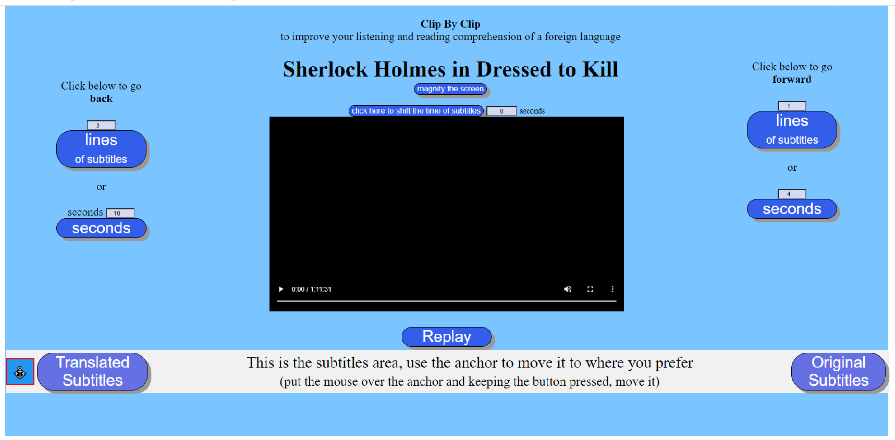
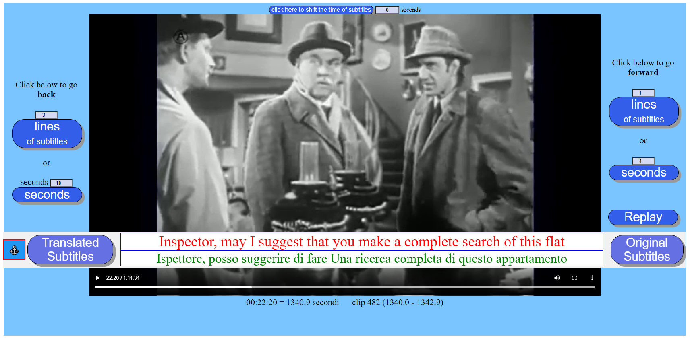

Clip By Clip
============

This application is a tool to improve the comprehension of a foreign language.

It lets you watch a video or listen to an audio in small pieces of the whished size. Each piece can be seen or listened several times in a row, then while listening you can read the subtitles in the same language as the spoken language and then with translated subtitles.

You can move back and forth a bit at a time or you can play the video or audio from start to finish without interruption, and at any time you can choose to read or hide the original and or the translated subtitles.

_The application was developed and tested on PC with Windows 10. It has been successfully tested with Google Chrome, Firefox and Microsoft Edge. It does not work with Internet Explorer. It is written in native HTML and Javascript so in theory it should work with most modern browsers._

Usage
-----

This ClipByClip application has two phases: construction and use.

In the first one, an html type file which we call **player** is built customized to play only the chosen video or audio file (one player for each video or audio file).

Once created, the player can be used as often as you want to practice comprehension of the language.

To start it, double click on this player file (file name example: **ClipByClip\_\_Sherlock Holmes in Dressed to Kill.html** )

A page appears, its central part is occupied by the video screen or the audio control line and the rest by various buttons.

You can start playing from the beginning by clicking in the video or audio control line,  
or pressing one of the 2 buttons on the right that allow you to play only a small piece the duration of which is defined by the number of seconds or the number of subtitle lines.

At the end you can replay the piece by pressing the **Replay** button.

The **Original Subtitles** and **Translated Subtitles** buttons allow you to show or hide subtitles.

After playing the same piece several times with and without subtitles, you can go on by clicking on one of the two buttons, or move forwards or backwards moving the cursor of the control line and then go on one piece at a time or continue without interruption until the end.  
If the application encounters intervals without dialogue it gives the possibility to skip them to move on to more interesting moments.

The **magnify the screen** button is used to eliminate unnecessary elements of the page to give more space to the video

Sometimes subtitles are not in a separate file, but they are embedded in the movie and there is no easy way to extract them.

This application tries to use these movies too, by covering the subtitles with an opaque stripe which can become transparent by pushing a button.

How To Build A Player
---------------------

Firstly you need to find a video or audio file on the web that also has its subtitle file.

For the prefixed purpose it is preferable that at least the subtitles in the original language have not been generated automatically.

It is unlikely to be able to find subtitles translated not automatically, most of the cases they don't even exist,  
in which case it is possible to get them by translating the original ones using Google or Bing or other similar products.  
The quality is generally sufficient for the understanding of the meaning (certainly not from a formal point of view).

Since the translation is the most burdensome part of the whole process, if it is not essential for your level of proficiency in the language, it is possible to completely omit the translated subtitles.

The subtitle files that the application can use are those of the **srt** type. If they are of another type, you need to search the web for some program that converts them to srt.

Download the video or audio file, the original subtitle file and possibly the one in your language if it exists. Move these files to the **VideoAudio** folder.

To start, run the **ClipByClip.html** file.

Files and folders 
-----------------

| Name          | Description    |
| :------------- | :-------------|
| **ClipByClip.html**  | the builder file (double click to run it) | 
| **scripts**   | folder whith all the script files  |
| **VideoAudio** | folder with the video or audio files to play |  
|                | es. Sherlock Holmes in Dressed to Kill.mp4 |
| **PLAYER**     | folder with the **player** files  |
|                |  es. ClipByClip\_\_Sherlock Holmes in Dressed to Kill.html |
